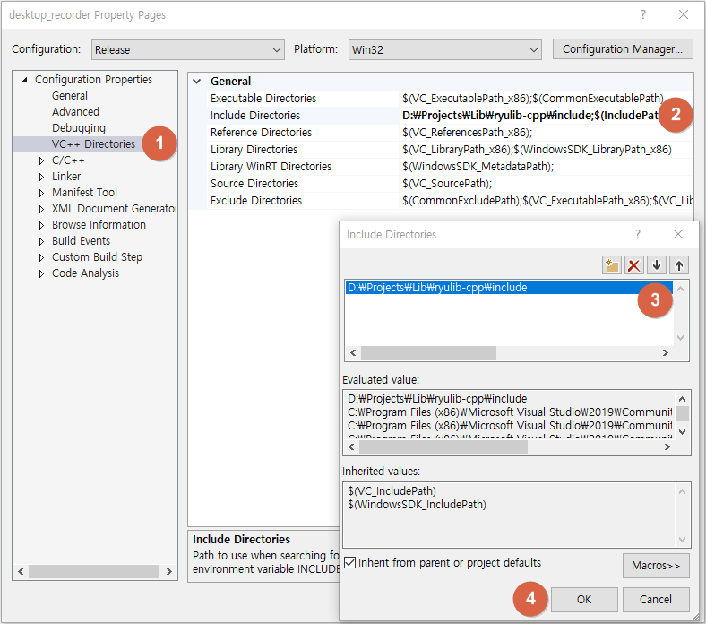

# RyuLib for C++ 설치

* 제가 자주 사용하는 라이브러리를 모아둔 저장소입니다.
* 제가 직접 만든 것도 있지만, 자주 사용하는 공개된 소스들을 가져와서 정리한 것들도 있습니다.

## Include Directories 설정

아래 이미지는 D:\Projects\Lib\ 폴더에서 클론 했을 경우에
Visual Studio의 C++ 프로젝트의 "Include Directories"에 등록하는 과정입니다.

1. 메뉴에서 "Project → Properties"를 선택하고, VC++ Directories 항목을 클릭합니다.
2. "Include Directories" 항목을 선택합니다.
3. ryulib-cpp가 설치된 폴더를 그림과 같이 include 폴더를 포함해서 선택합니다.
4. OK 버튼을 클릭합니다.
